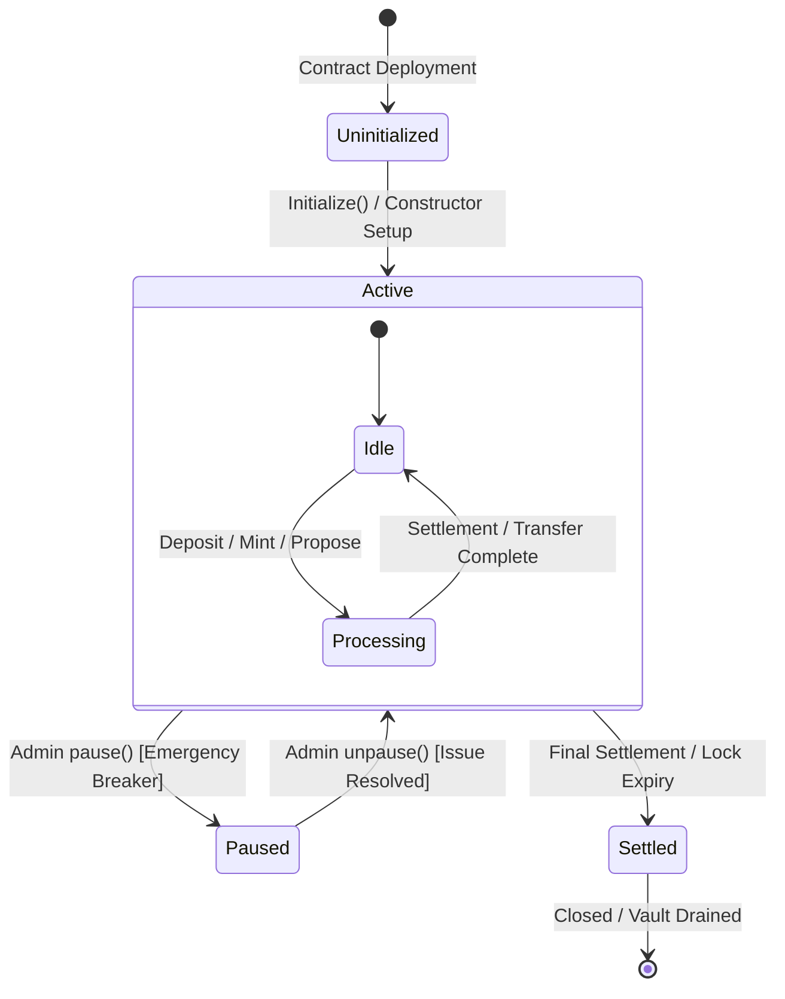

# State Machine & Transition Flowchart

**Project Name:** ERC20 Token Test Benchmark (Simple)

```mermaid
stateDiagram-v2
    [*] --> Uninitialized: Contract Deployment
    Uninitialized --> Active: Initialize() / Constructor Setup
    
    state Active {
        [*] --> Idle
        Idle --> Processing: Deposit / Mint / Propose
        Processing --> Idle: Settlement / Transfer Complete
    }

    Active --> Paused: Admin pause() [Emergency Breaker]
    Paused --> Active: Admin unpause() [Issue Resolved]

    Active --> Settled: Final Settlement / Lock Expiry
    Settled --> [*]: Closed / Vault Drained
```
