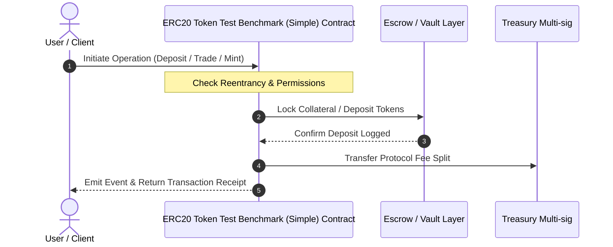

# System Sequence Diagrams

**Project Name:** ERC20 Token Test Benchmark (Simple)

## 1. Core User Interaction & Settlement Sequence



## 2. Emergency Pause & Recovery Sequence

```mermaid
sequenceDiagram
    autonumber
    actor Admin as Admin / Multi-sig
    participant Contract as ERC20 Token Test Benchmark (Simple) Contract
    actor Attacker as Suspicious Caller

    Attacker->>Contract: Attempt Exploit Call
    Admin->>Contract: call pause()
    Note over Contract: state set to paused = true
    Contract-->>Admin: Emit Paused() Event
    Attacker->>Contract: State Mutating Call
    Contract-->>Attacker: Revert Enforcement (Pausable: paused)